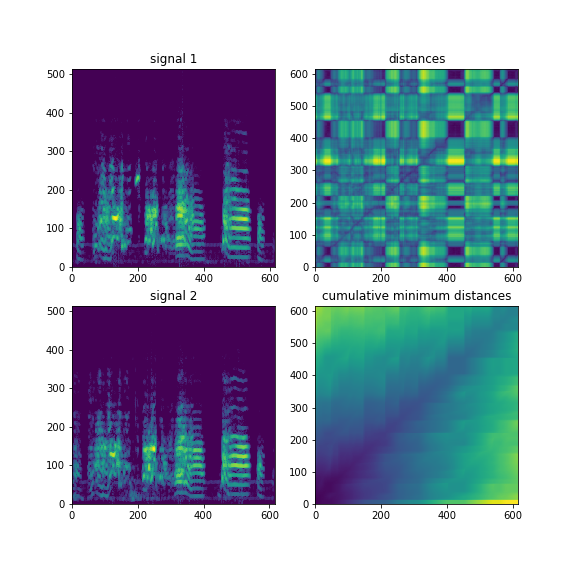

# ezdtw




`ezdtw` is a pure Python dynamic time warping library, intended for warping acoustic spectrograms.

This implementation uses two performance tricks:

1. Distances are computed using Scipy's cdist function.
2. The cumulative minimum distance calculation uses the [numba](https://numba.pydata.org) jit compiler for a 500x speedup.

Computing the warp path between two typical zebra finch song motif spectrograms takes approximately 60ms of computation time.

## Requirments

+ Python 3
+ numpy
+ scipy
+ numba

You may want to use [resin](https://github.com/kylerbrown/resin) for creating spectrograms.

## Installation
````shell
git clone https://github.com/kylerbrown/ezdtw.git
cd ezdtw
pip install .
````

## Usage

````python
from ezdtw import dtw

x, y = dtw(A, B)
````

See an example in the `example/` folder.
